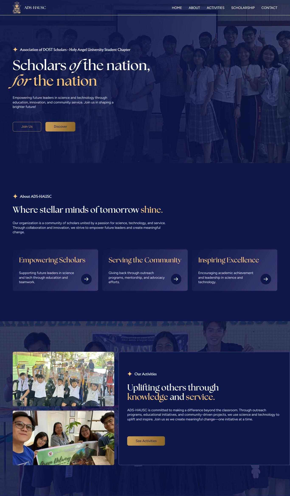

# IskoLink - HAU DOST Scholars (ADS-HAUSC) Website
IskoLink is an online platform for the Association of DOST Scholars - Holy Angel University Student Chapter (ADS-HAUSC), built to strengthen connections among scholars and create a lasting impact on the community.

More than just a hub for updates and resources, this website promotes education, outreach, and collaboration, allowing scholars to use science and technology for meaningful change. Through knowledge-sharing and service, IskoLink empowers scholars to inspire future leaders and contribute to national development.

## Live Website
You may access the live website here: https://adshausc.netlify.app/

## Screenshot/Preview
You can also view our Figma design mockups here: [View on Figma](https://www.figma.com/design/ntISwNSrTCRAeQnbHw63eq/-R--ADS-HAUSC-Design-Mockups)

## Key Features
- **Admin Dashboard** – Manage organization activities/events and contact form submissions.
- **Comprehensive Information Hub** – Centralized platform for ADS-HAUSC’s mission, events, and scholarship details.
- **Responsive Web Design** – Ensures seamless performance on mobile, tablet, and desktop.
- **Activity Management with Cloud Storage** – Admins can add, update, and delete activities, with Cloudinary for image storage.
- **Secure User Authentication** – Secure admin login using JWT (JSON Web Token).
- **Interactive Contact Form** – Users can send messages or inquiries effortlessly.
- **Scholarship Information** – Detailed insights on DOST scholarships, priority courses, and application steps.
- **User-Friendly UI** – Smooth animations and an intuitive, easy-to-navigate interface.

## Pages
Each page aligns with ADS-HAUSC’s mission, ensuring easy access to information and fostering scholar engagement.

### Public Pages
- **Homepage** – Overview of ADS-HAUSC, key actions, FAQs, and quick links.
- **About Page** – History, mission, vision, leadership, and core values.
- **Activities Page** – Showcases events, outreach programs, and scholar-led initiatives.
- **Scholarships Page** – Essential details on DOST scholarships, priority courses, and requirements.
- **Contact Page** – Inquiry form for users to reach out to ADS-HAUSC.

### Admin-Exclusive Pages
Restricted to authorized users for secure content management.
- **Admin Login** `/admin-login` – Secure portal for admin access (JWT authentication).
- **Admin Dashboard (Activities)**`/admin-dashboard` – Manage activities (view, add, edit, delete) with Cloudinary image storage.
- **Admin Dashboard (Forms)**`/admin-dashboard` – View, edit, or delete form submissions from the contact page.

## Tools and Technologies
IskoLink is a dynamic web application built with the MEAN stack (MongoDB, Express.js, Angular, and Node.js), ensuring scalability, performance, and security. By leveraging modern technologies, the platform delivers an optimized user experience, robust backend functionality, and seamless interactions across devices.

### Frontend
- **Framework**: Angular
- **Styling**: Tailwind CSS, Angular Material
- **Animations**: GSAP, Lenis
- **SEO Optimization**: WebP, Lazy Loading

### Backend
- **Server & API**: Node.js, Express.js
- **Database Management**: MongoDB Atlas, Mongoose
- **Authentication & Security**: JSON Web Token (JWT), Crypto
- **File Upload & Cloud Storage**: Multer, Cloudinary
- **API Testing**: Postman

### Deployment & Hosting
- **Netlify**: Frontend deployment
- **Render**: Backend server hosting

## Development Team 
| Name | Role |
|-|-|
| Jimwel Valdez [(@jimvdz)](https://github.com/jimvdz) | Project Lead / Back-End Lead Dev / Front-End Dev / UI/UX Designer |
| Bryan Aaron Santiago [(@Bancantcode)](https://github.com/Bancantcode) | Front-End Lead Dev / Back-End Dev / UI/UX Designer |
| Frances Luis Tumampos [(@cess2c)](https://github.com/cess2c) | Front-End Developer / UI/UX Designer |
| Luis Miguel Cayanan [(@lmcay)](https://github.com/lmcay)| Front-End Developer / UI/UX Designer |

Copyright &copy; 2025 by Valdez, Santiago, Tumampos, Cayanan, and ADS-HAUSC. All rights reserved.
